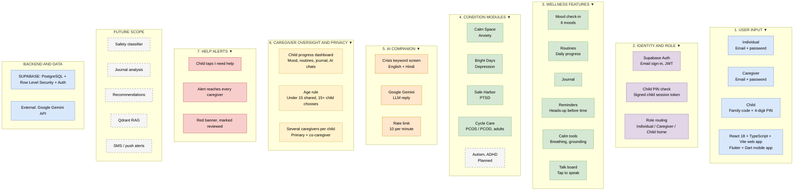

# SafeSpace - Technical Approach

Paste the block into https://mermaid.live to edit or export. GitHub renders it directly.

```mermaid
flowchart TB
  classDef input fill:#dae8fc,stroke:#6c8ebf,color:#000
  classDef ident fill:#e1d5e7,stroke:#9673a6,color:#000
  classDef feat fill:#d5e8d4,stroke:#82b366,color:#000
  classDef ai fill:#ffe6cc,stroke:#d79b00,color:#000
  classDef care fill:#fff2cc,stroke:#d6b656,color:#000
  classDef alert fill:#f8cecc,stroke:#b85450,color:#000
  classDef plan fill:#f5f5f5,stroke:#666,color:#000,stroke-dasharray: 5 5
  classDef data fill:#dae8fc,stroke:#6c8ebf,color:#000

  subgraph S1["1. USER INPUT  ▼"]
    direction LR
    U1["Individual<br/>Email + password"]
    U2["Caregiver<br/>Email + password"]
    U3["Child<br/>Family code + 4-digit PIN"]
    APPS["React 18 + TypeScript + Vite web app<br/>Flutter + Dart mobile app"]
  end

  subgraph S2["2. IDENTITY AND ROLE  ▼"]
    direction LR
    A1["Supabase Auth<br/>Email sign-in, JWT"]
    A2["Child PIN check<br/>Signed child session token"]
    A3["Role routing<br/>Individual / Caregiver / Child home"]
  end

  subgraph S3["3. WELLNESS FEATURES  ▼"]
    direction LR
    F1["Mood check-in<br/>6 moods"]
    F2["Routines<br/>Daily progress"]
    F3["Journal"]
    F4["Reminders<br/>Heads-up before time"]
    F5["Calm tools<br/>Breathing, grounding"]
    F6["Talk board<br/>Tap to speak"]
  end

  subgraph S4["4. CONDITION MODULES  ▼"]
    direction LR
    M1["Calm Space<br/>Anxiety"]
    M2["Bright Days<br/>Depression"]
    M3["Safe Harbor<br/>PTSD"]
    M4["Cycle Care<br/>PCOS / PCOD, adults"]
    M5["Autism, ADHD<br/>Planned"]
  end

  subgraph S5["5. AI COMPANION  ▼"]
    direction LR
    G1["Crisis keyword screen<br/>English + Hindi"]
    G2["Google Gemini<br/>LLM reply"]
    G3["Rate limit<br/>10 per minute"]
  end

  subgraph S6["6. CAREGIVER OVERSIGHT AND PRIVACY  ▼"]
    direction LR
    C1["Child progress dashboard<br/>Mood, routines, journal, AI chats"]
    C2["Age rule<br/>Under 15 shared, 15+ child chooses"]
    C3["Several caregivers per child<br/>Primary + co-caregiver"]
  end

  subgraph S7["7. HELP ALERTS  ▼"]
    direction LR
    L1["Child taps I need help"]
    L2["Alert reaches every caregiver"]
    L3["Red banner, marked reviewed"]
  end

  subgraph FUT["FUTURE SCOPE"]
    direction LR
    P1["Safety classifier"]
    P2["Journal analysis"]
    P3["Recommendations"]
    P4["Qdrant RAG"]
    P5["SMS / push alerts"]
  end


  subgraph DB["BACKEND AND DATA"]
    direction LR
    D1["SUPABASE: PostgreSQL + Row Level Security + Auth"]
    D2["External: Google Gemini API"]
  end


  class U1,U2,U3,APPS input
  class A1,A2,A3 ident
  class F1,F2,F3,F4,F5,F6,M1,M2,M3,M4 feat
  class G1,G2,G3 ai
  class C1,C2,C3 care
  class L1,L2,L3 alert
  class M5,P1,P2,P3,P4,P5 plan
  class D1,D2 data

```
